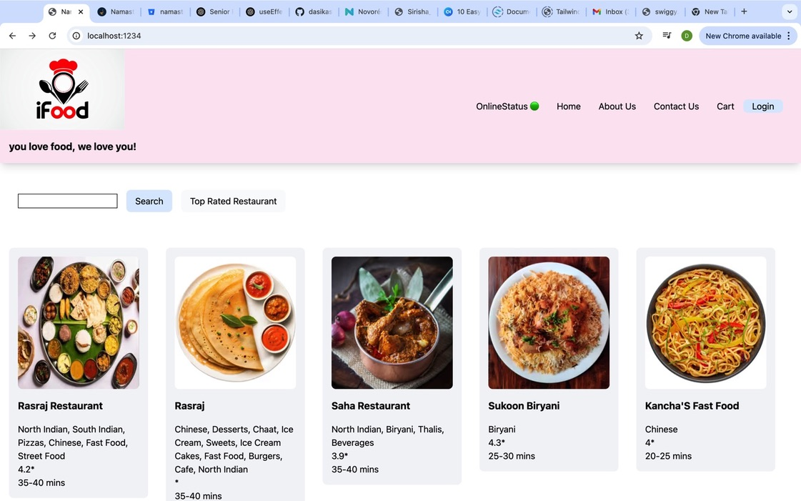

# Namaste REACT 🚀

# Parcel

- Dev Build
- local server
- HMR = Hot module replacement
- File watching Algorithm - written in c++
- Faster Builds - Caching
- Image Optimization
- Minification 
- Bundling
- Compressing
- Consistent Hashing
- Code Splitting
- Differential Bundling - support older browsers
- Diagnostic
- Error Hnadling
- Host app on Https
- Tree Shaking - removes unused code 
- Parcel can be used in Lazy or Https mode
- Different dev and prod bundles

# Routing in web apps
- Client side routing --No network call made while navigating the pages
- Server side Routing -- network calls are made while routing to different pages from index.html

Single page application implements client side routing

preview of App: (still in progress)
npm start

